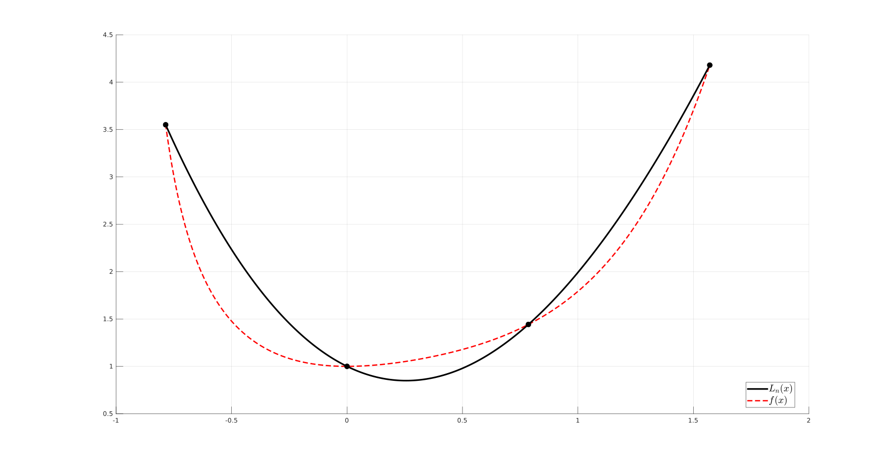
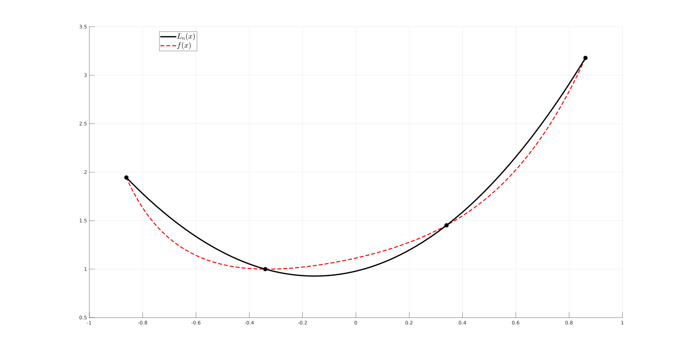
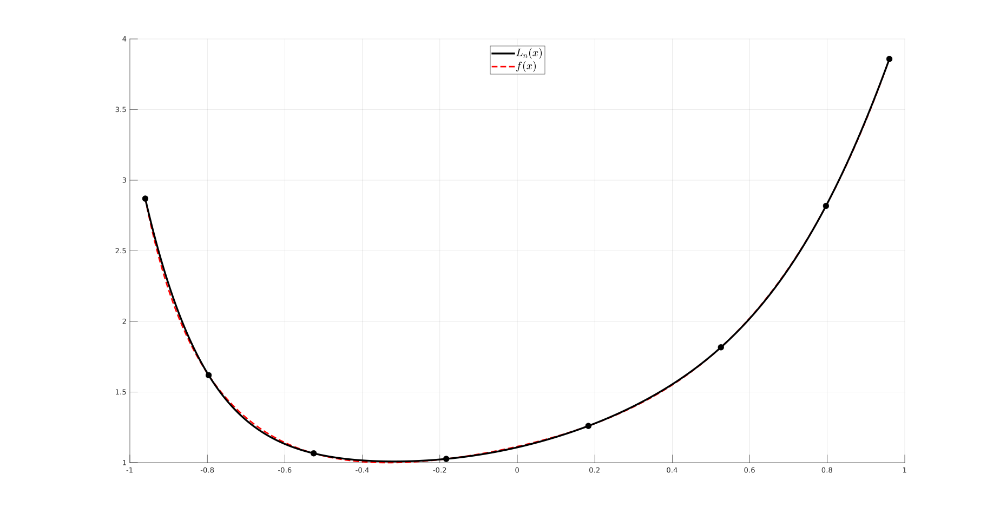
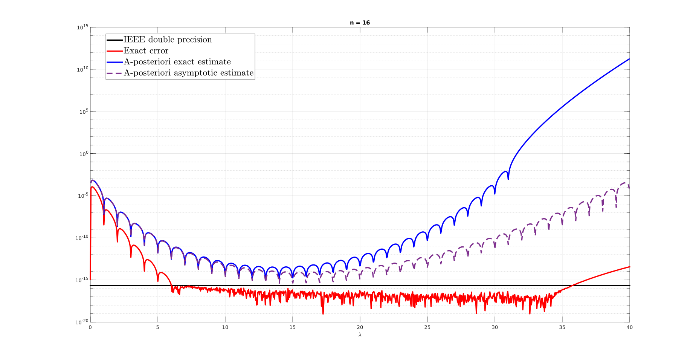
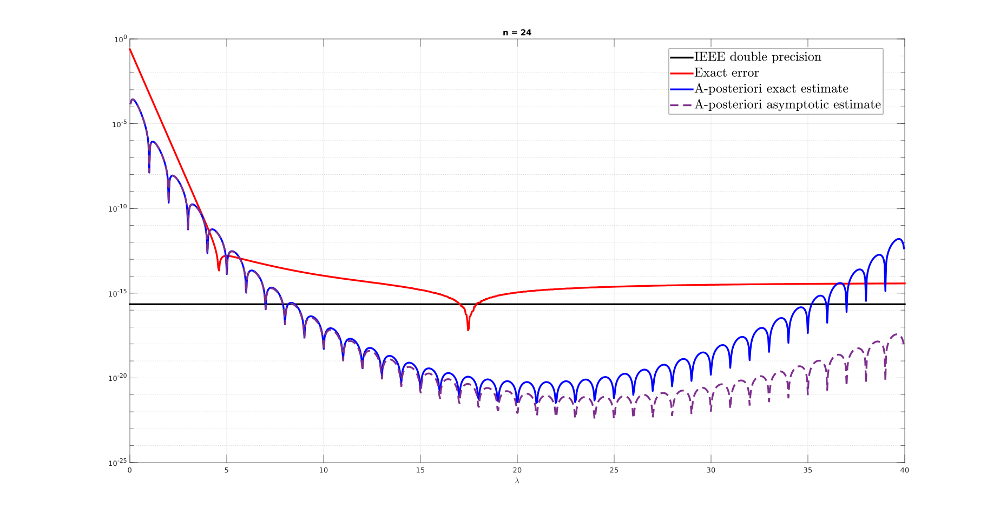

# NQL - Numerical Quadrature Library

This library implements in MATLAB an automatic numerical integration routine using __Newton-Cotes__ and __Gauss-Legendre__ formulae.

## Main structure
The library consists of
- [x] `main.m` computes the necessary parameters according to the choice of formulae provided by the user (nodes, affine map coefficients, jacobian etc...);
- [x] `legendre.m` if Gauss-Legendre formulae is selected it computes the nodes of the _N-th_ degree Legendre's polynomial while displaying the recursive polynomials used for its construction (optional) like so
	
- [x] `quadrature.m` defines the workflow for the computation of the weigths associated to the Lagrangian basis' functions;
- [x] `lagrangian_weights.m` computes the aforementioned weights;
- [x] `lagrange.m` computes iteratively the _NxN_ coefficient matrix associated to the _N_ Lagrange's polynomials of degree _N-1_ and plots them over the specified interval (optional) as shown
	
- [x] `extract_basis.m` for each node computes the coefficients of all monomials associated recursively to Lagrange's polynomial associated to that node;
The simulation can be launched by script or by calling `main.m` direclty from the command window. In either cases the input parameters must be specified which are
	* interval of integration _I = [a,b]_ specified through its endpoints `a` and `b`;
	* integrand, or target function _f(x)_, specified as `kernel`;
	* number of discretisation nodes _N_ in _I_ for the numerical quadrature;
	* optional global variables (see below). 

## Options
The values of the global variables have to be specified either if the user does not intend to use such options. The latter are:
- [x] `tabulated` The library can optionally choose to compute numerically the roots of the Legendre's polynomial via linear interpolation (set flag variable to 0) or to reference them from tabulated values with 289 decimal digits provided by [Pomax's repository](https://pomax.github.io/bezierinfo/legendre-gauss.html) (set flag to 1);
- [x] `precision` Numerical integration famously requires a high degree of precision in arithmetic in order to obtain sufficiently accurate results. Therefore the library allows the user to select such precision to an arbitrary value by setting this variable to the integer number of decimal digits the computation requires (e.g. `precision=16` sets the library to run with MATLAB's default precision which is 16 digits);
- [x] `print_polynomials` To display Legendre's polynomials and Lagrange's basis functions depicted above set the flag value to 1 otherwise set it to 0; if Gauss-Legendre formula is used the Lagrangian basis function are depicted in [-1,1] instead of [a,b];
- [x] `print_quadrature` To display the Lagrange's interpolating polynomial overlayed with the target kernel of integration set the flag value to 1 otherwise set it to 0; if Gauss-Legendre is used both functions are plotted in [-1,1] instead of [a,b]  (see __Examples__ below).

## Accessories
To support data management and visualisation the following functions have been provided:
- [x] `tab_legendre.m` contains tabulated values of the nodes of Legendre's ploynomial up to the 32nd degree;
- [x] `cmap.m` defines a colormap based on the interpolation of 8 colors and according to the number of Legendre's and Lagrange's functions are defined;
- [x] `doubledot.m` computes the inner product between two vectors but in ascending order of values so to avoid numerical cancellation;

## Examples
The user can launch one of the scripts contained in the [examples](examples/test.m) directory, specifically the purposely-defined `test.m` script, to get accustomed with the settings and outputs of the library. In there both Newton-Cotes and Gauss-Legendre formulae are used to integrate numerically the function  in the interval . The Lagrange's interpolating polynomial is reported for both formulae

| Newton-Cotes (N=4)           | Gauss-Legendre (N=4) 		   |
| -----------------------------| ------------------------------|
| |  |

| Newton-Cotes (N=8)           | Gauss-Legendre (N=8)          |
| -----------------------------| ------------------------------|
| |  |

## Suggested benchmarks
This suite was built for educational purposes and as a quick first reference for testing more performant softwares for numerical integration. As a benchmark for its performance against fairly demanding computations in the script [benchmark.m](examples/benchmark.m) the results displayed in Figure 2 from the paper [Design of quadrature rules for Müntz and Müntz-logarithmic polynomials using monomial transformation](https://onlinelibrary.wiley.com/doi/abs/10.1002/nme.2684) are replicated. The kernel is a sequence of Müntz monomials of the form 
where `lambda` is a real-valued exponent ranging continuosly from 0 to 48; in the simulation such continuous interval is discretised in _500_ samples while using a precision of _100_ (decimal) digits. With _N=16_ nodes the errors are

while with _N=24_ nodes of interpolation the errors are

where, with an abuse of notation, the _a-priori estimate_ is referred to the L1-norm of the difference between the exact definite integral and NQL's output. The tests, ran both on a i5-1035G1 quad-core processor with 8 GB of RAM, took approximately 3 hours to complete. The library does satisfy the expected accuracy in terms of IEEE d.p..